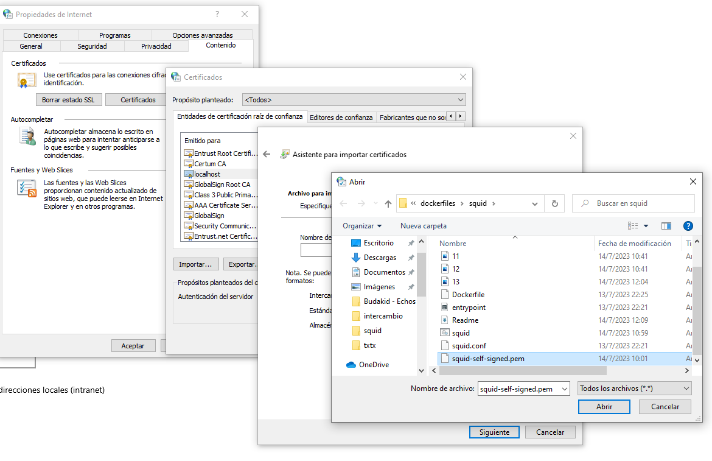
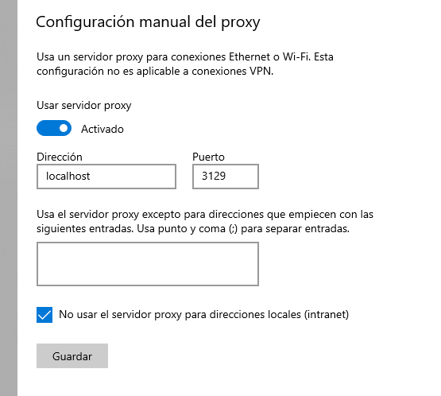

# Squid proxy cache

``` bash
docker build -t squid .
docker run -d --restart=always --publish 3129:3129  --publish 3128:3128  --volume $(pwd)/squid/cache:/var/spool/squid   squid
```

## Copiar el certificado desde el contenedor

``` bash
docker ps -q -f "ancestor=squid"
## copiar el cerificado desde el contenedor
``` bash
container_id=$(docker ps -q -f "ancestor=squid")
docker cp $container_id:/usr/local/squid/etc/ssl_cert/squid-self-signed.pem squid-self-signed.pem

# para docker

docker cp $container_id:/usr/local/squid/etc/ssl_cert/squid-self-signed.pem ca.pem
docker cp $container_id:/usr/local/squid/etc/ssl_cert/squid-self-signed.key key.pem
docker cp $container_id:/usr/local/squid/etc/ssl_cert/squid-self-signed.crt crt.pem

```

## Setear estas variables de entorno para que docker encuentre ca.pem key.pem crt.pem

``` bash

SET DOCKER_CERT_PATH="C:\where_the_certs_are\proxy-cache"
SET DOCKER_TLS_CERTDIR="C:\where_the_certs_are\proxy-cache"
SET DOCKER_TLS_VERIFY=1
SET HTTP_PROXY="http://192.168.100.16:3128"
SET HTTPS_PROXY="http://192.168.100.16:3129"
SET NO_PROXY="localhost"

```

## Importar Certificado
Si se utiliza el navegador sin antes agregar el certificado dara error de MITM








puertos por defecto
3129 https
3128 http

Basado en
https://rasika90.medium.com/how-i-saved-tons-of-gbs-with-https-caching-41550b4ada8a


