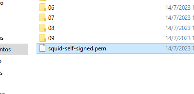
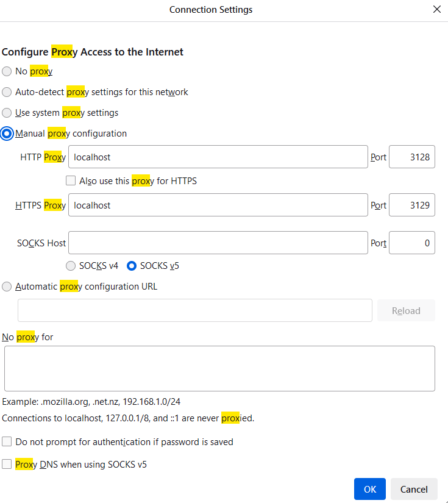

# squid proxy cache

``` bash
docker build -t squid .
docker run -d --restart=always --publish 3129:3129  --publish 3128:3128  --volume $(pwd)/squid/cache:/var/spool/squid   squid
```

## copiar el cerificado desde el contenedor

docker ps -q -f "ancestor=squid"


docker cp 8a2b1f8026c6:/usr/local/squid/etc/ssl_cert/squid-self-signed.pem squid-self-signed.pem

para docker

docker cp 8a2b1f8026c6:/usr/local/squid/etc/ssl_cert/squid-self-signed.pem ca.pem
docker cp 8a2b1f8026c6:/usr/local/squid/etc/ssl_cert/squid-self-signed.key key.pem
docker cp 8a2b1f8026c6:/usr/local/squid/etc/ssl_cert/squid-self-signed.crt crt.pem

setear variables de entorno para docker donde esten ca.pem key.pem crt.pem

SET DOCKER_CERT_PATH=C:\................\squid
SET DOCKER_TLS_CERTDIR=C::\................\squid
SET DOCKER_TLS_VERIFY=0


## importar Certificado en firefox
si se utiliza en navegadores sin antes agregar el certificado dara error de MITM








puertos por defecto
3129 https
3128 http

Basado en
https://rasika90.medium.com/how-i-saved-tons-of-gbs-with-https-caching-41550b4ada8a


